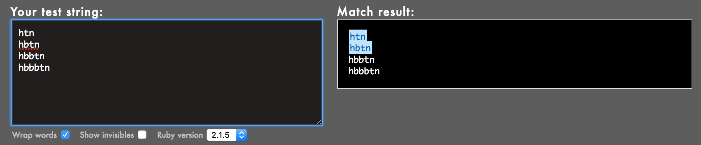

# 0x06. Regular expression

### 0) [Simply matching School](https://github.com/s-maarouf/alx-system_engineering-devops/blob/master/0x06-regular_expressions/0-simply_match_school.rb)


Requirements:

- The regular expression must match `School`
- Using the project instructions, create a Ruby script that accepts one argument and pass it to a regular expression matching method

Example:

```sh
sylvain@ubuntu$ ./0-simply_match_school.rb School | cat -e
School$
sylvain@ubuntu$ ./0-simply_match_school.rb "Best School" | cat -e
School$
sylvain@ubuntu$ ./0-simply_match_school.rb "School Best School" | cat -e
SchoolSchool$
sylvain@ubuntu$ ./0-simply_match_school.rb "Grace Hopper" | cat -e
$
```

### 1) [Repetition Token #0](https://github.com/s-maarouf/alx-system_engineering-devops/blob/master/0x06-regular_expressions/1-repetition_token_0.rb)


Requirements:

- Find the regular expression that will match the above cases
- Using the project instructions, create a Ruby script that accepts one argument and pass it to a regular expression matching method

### 2) [Repetition Token #1](https://github.com/s-maarouf/alx-system_engineering-devops/blob/master/0x06-regular_expressions/2-repetition_token_1.rb)



Requirements:

- Find the regular expression that will match the above cases
- Using the project instructions, create a Ruby script that accepts one argument and pass it to a regular expression matching method

### 3) [Repetition Token #2](https://github.com/s-maarouf/alx-system_engineering-devops/blob/master/0x06-regular_expressions/3-repetition_token_2.rb)


Requirements:

- Find the regular expression that will match the above cases
- Using the project instructions, create a Ruby script that accepts one argument and pass it to a regular expression matching method

### 4) [Repetition Token #3](https://github.com/s-maarouf/alx-system_engineering-devops/blob/master/0x06-regular_expressions/4-repetition_token_3.rb)


Requirements:

- Find the regular expression that will match the above cases
- Using the project instructions, create a Ruby script that accepts one argument and pass it to a regular expression matching method
- Your regex should not contain square brackets

### 5) [Not quite HBTN yet](https://github.com/s-maarouf/alx-system_engineering-devops/blob/master/0x06-regular_expressions/5-beginning_and_end.rb)

Requirements:

- The regular expression must be exactly matching a string that starts with `h` ends with `n` and can have any single character in between
- Using the project instructions, create a Ruby script that accepts one argument and pass it to a regular expression matching method

Example:

```sh
sylvain@ubuntu$ ./5-beginning_and_end.rb 'hn' | cat -e
$
sylvain@ubuntu$ ./5-beginning_and_end.rb 'hbn' | cat -e
hbn$
sylvain@ubuntu$ ./5-beginning_and_end.rb 'hbtn' | cat -e
$
sylvain@ubuntu$ ./5-beginning_and_end.rb 'h8n' | cat -e
h8n$
sylvain@ubuntu$
$
```

### 6) [Call me maybe](https://github.com/s-maarouf/alx-system_engineering-devops/blob/master/0x06-regular_expressions/6-phone_number.rb)

Requirement:

- The regular expression must match a 10 digit phone number

Example:

```sh
sylvain@ubuntu$ ./6-phone_number.rb 4155049898 | cat -e
4155049898$
sylvain@ubuntu$ ./6-phone_number.rb " 4155049898" | cat -e
$
sylvain@ubuntu$ ./6-phone_number.rb "415 504 9898" | cat -e
$
sylvain@ubuntu$ ./6-phone_number.rb "415-504-9898" | cat -e
$
sylvain@ubuntu$
```

### 7) [OMG WHY ARE YOU SHOUTING?](https://github.com/s-maarouf/alx-system_engineering-devops/blob/master/0x06-regular_expressions/7-OMG_WHY_ARE_YOU_SHOUTING.rb)

Requirement:

- The regular expression must be only matching: capital letters

Example:

```sh
sylvain@ubuntu$ ./7-OMG_WHY_ARE_YOU_SHOUTING.rb "I realLy hOpe VancouvEr posseSs Yummy Soft vAnilla Dupper Mint Ice Nutella cream" | cat -e
ILOVESYSADMIN$
sylvain@ubuntu$ ./7-OMG_WHY_ARE_YOU_SHOUTING.rb "WHAT do you SAY?" | cat -e
WHATSAY$
sylvain@ubuntu$ ./7-OMG_WHY_ARE_YOU_SHOUTING.rb "cannot read you" | cat -e
$
sylvain@ubuntu$
```

### 8) Textme

> UNCOMPLETED

This exercise was prepared for you by Guillaume Plessis, VP of Infrastructure at TextMe. It is something he uses daily. You can thank Guillaume for his project on Twitter.

For this task, you’ll be taking over Guillaume’s responsibilities: one afternoon, a TextMe VoIP Engineer comes to you and explains she wants to run some statistics on the TextMe app text messages transactions.

Requirements:

- Your script should output: `[SENDER],[RECEIVER],[FLAGS]`
  - The sender phone number or name (including country code if present)
  - The receiver phone number or name (including country code if present)
  - The flags that were used

You can find a [[log file here]](http://intranet-projects-files.s3.amazonaws.com/holbertonschool-sysadmin_devops/78/text_messages.log).

Example:

```sh
$ ./100-textme.rb 'Feb 1 11:00:00 ip-10-0-0-11 mdr: 2016-02-01 11:00:00 Receive SMS [SMSC:SYBASE1] [SVC:] [ACT:] [BINF:] [FID:] [from:Google] [to:+16474951758] [flags:-1:0:-1:0:-1] [msg:127:This planet has - or rather had - a problem, which was this: most of the people on it were unhappy for pretty much of the time.] [udh:0:]'
Google,+16474951758,-1:0:-1:0:-1
$
$
$ ./100-textme.rb 'Feb 1 11:00:00 ip-10-0-64-10 mdr: 2016-02-01 11:00:00 Receive SMS [SMSC:SYBASE2] [SVC:] [ACT:] [BINF:] [FID:] [from:+17272713208] [to:+19172319348] [flags:-1:0:-1:0:-1] [msg:136:Orbiting this at a distance of roughly ninety-two million miles is an utterly insignificant little blue green planet whose ape-descended] [udh:0:]'
+17272713208,+19172319348,-1:0:-1:0:-1
$
$ ./100-textme.rb 'Feb 1 11:00:00 ip-10-0-64-11 mdr: 2016-02-01 11:00:00 Sent SMS [SMSC:SYBASE1] [SVC:backendtextme] [ACT:] [BINF:] [FID:] [from:18572406905] [to:14022180266] [flags:-1:0:-1:-1:-1] [msg:136:Far out in the uncharted backwaters of the unfashionable end of the western spiral arm of the Galaxy lies a small unregarded yellow sun.] [udh:0:]'
18572406905,14022180266,-1:0:-1:-1:-1
$
$
$ ./100-textme.rb 'Feb 1 11:00:00 ip-10-0-64-11 mdr: 2016-02-01 11:00:00 Sent SMS [SMSC:SYBASE1] [SVC:backendtextme] [ACT:] [BINF:] [FID:] [from:12392190384] [to:19148265919] [flags:-1:0:-1:-1:-1] [msg:99:life forms are so amazingly primitive that they still think digital watches are a pretty neat idea.] [udh:0:]'
12392190384,19148265919,-1:0:-1:-1:-1
$
```
